

# 🧠 InterviewIQ AI
### AI-Powered Interview Coach

An intelligent interview preparation platform powered by <b>Groq AI + Llama 3.3 70B</b>.
Generate realistic interview questions, receive AI feedback, analyze resumes, and improve your interview performance.

  
## 🚀 Live Demo

### 👉 **Try InterviewIQ AI**

> ⚡ Experience AI-powered interview simulations instantly.
## 🏗️ System Architecture

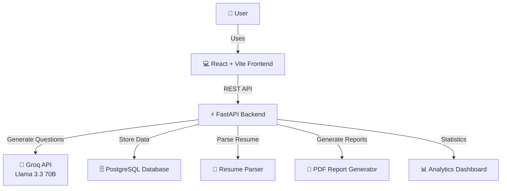

## 🔄 Application Workflow

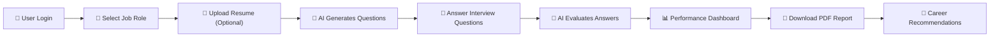

## 🔐 Authentication Flow

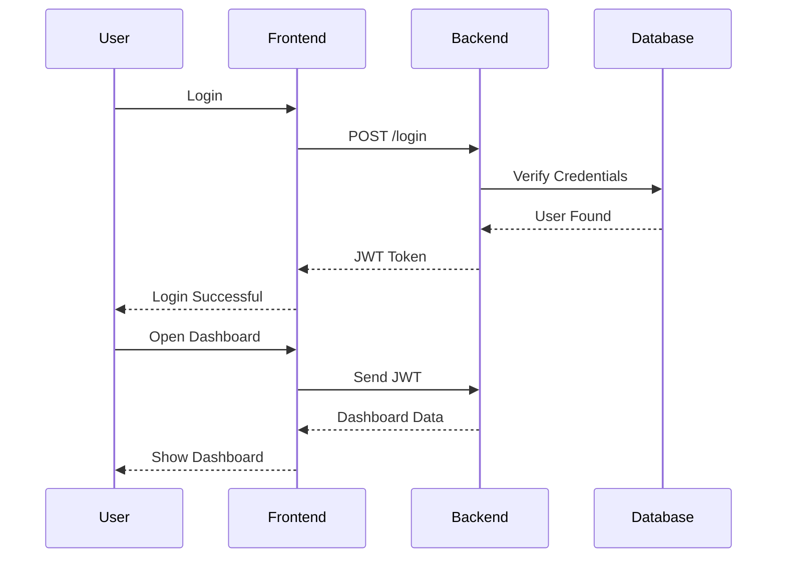

## 🤖 AI Interview Pipeline

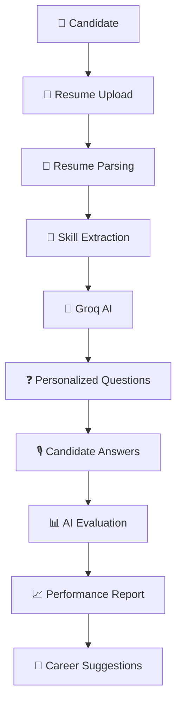

## 🏛 Backend Architecture

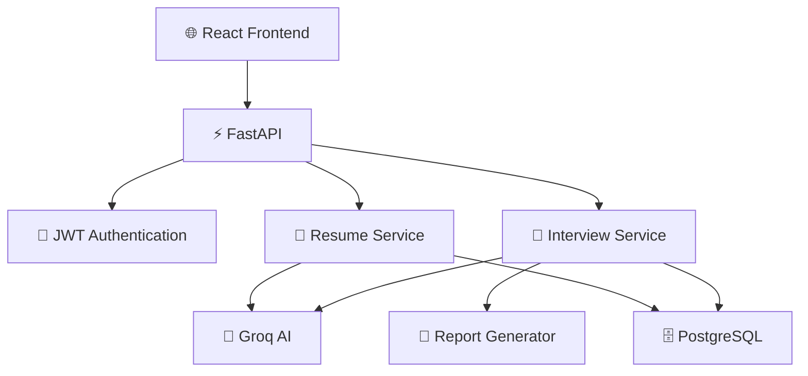

## 🗄 Database Design

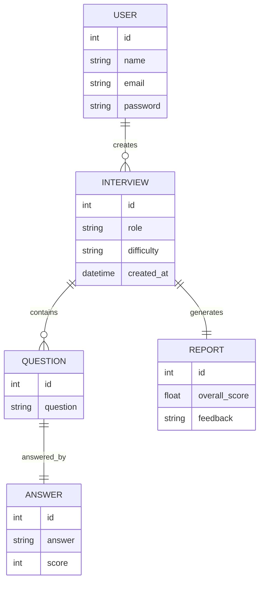

## 📡 API Request Flow

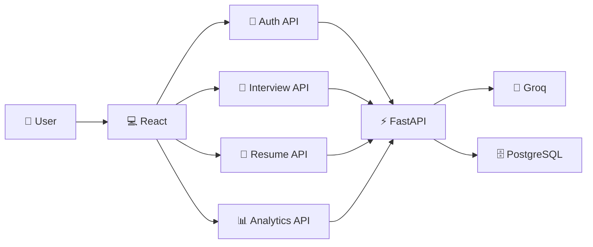

## 🧠 AI Answer Evaluation

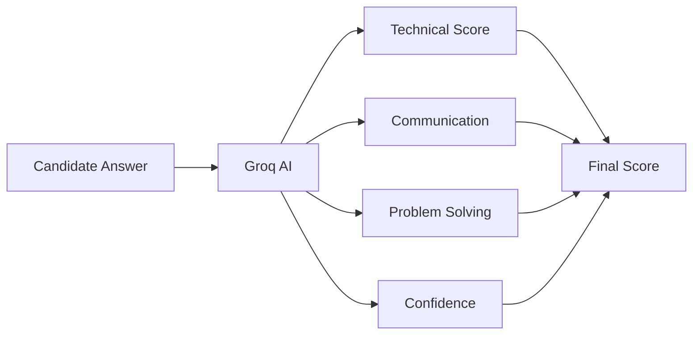

## 📈 User Journey

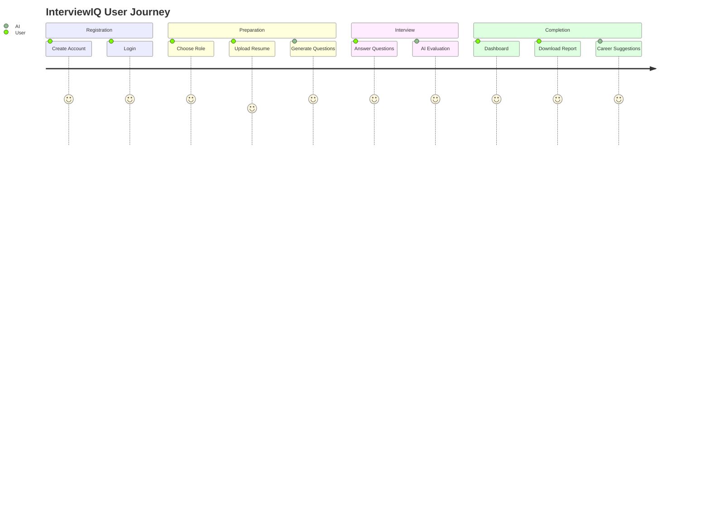
## 🛠 Technology Stack

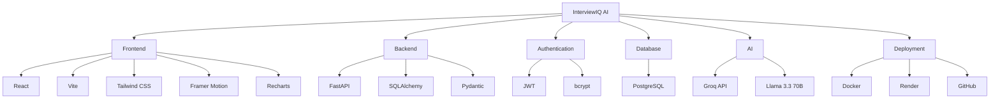

## 🚀 Deployment Architecture

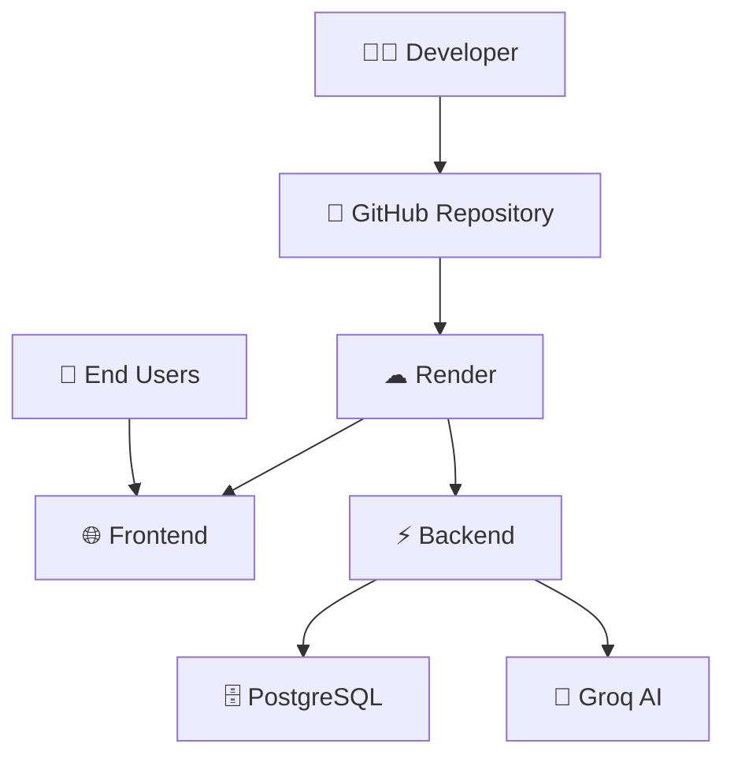

# 🚀 Live Demo

### ⭐ Experience AI-Powered Interview Preparation in Real Time

